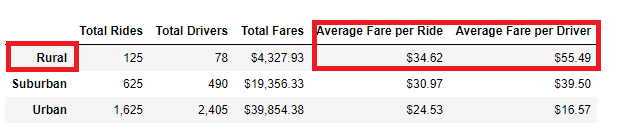

# PyBer_Analysis  

## Overview of the Analysis 

Today is the day, we just received the work assignment of a lifetime by being assigned a compelling project from V. Isualize and we are excited and ready for the challenge.  We have been asked to create a summary of the ride-sharing data by city type as well as create a multiple-line graph that shows the total weekly fares for each city type.  To accomplish this task, we will need to analyze two datasets containing four months of rideshare data ranging from January to early May of 2019.  Creating data analysis and visualizations of rideshare data for PyBer will help to improve access to ride-sharing services and affordability for underserved neighborhoods.  As you can see below, we have a great dataset to review but we need to sharpen our focus and outputs in order to offer three business recommendations to the CEO for addressing any disparities among the city types. Let’s get ready to drive results and solutions to V. Isualize and the PyBer decision-makers.  

  

## Results  

**Organize the Data**  
One of the most critical steps of our process was to organize of the ride-sharing data by total rides, total drivers, and total fares.  From there, we calculated the average fare per ride and average fare per driver for each city type.  The chart below shows how the itemized data mapped out under each column heading.  

  

**Total Rides, Total Drivers, and Total Fares - Oh My**  

When we look at the data - it tells a telling story for the Urban City Type.  They hold the largest totals and percentages for Total Rides, Total Drivers, and Total Fares.  That falls inline with economic expectations - where there is a large demand, there will be a large supply of service as well.   
The Sububran City Type is steady producer for totals and I think that is expected.  I find the Suburban City Type has an interesting narrative - they contribute ~26% of the Total Rides but what is eye-catching is that they are responsible for ~31% of the Total Fares with only ~17% of the Total Drivers.   
We need to remember the Rural City Type - this will be an area of recommendation to V. Isualize and the PyBer decision-makers. What they lack in total numbers, they make it up in the average fare by driver and by ride.  Let's discuss the averages in the next section of our results below.  
  

  

  

**Average Fare per Ride and Average Fare per Driver**  

The Rural City Type has high averages when it comes to average fare per driver and average fare per ride.  This looks good on paper but in reality, the lack of use and affordability needs to be addressed.  We have a low number of drivers in the Rural area as well as a low ride share.  This data is going to lead us to make a strong recommendation to V. Isualize and the decision-makers of PyBer so that we can make decisions about the Rural area needing more driver support, which in turn is not allow the Rural demographic to generate enough cash flow for the company.    
  

**Total Fare by City Type**  
I love this chart - it allows us to see a timeline of the ups and downs of business over the past four months.  What excites me about this graph is the opportunity that the Suburban City Type is showing since the start of April.  We need to do a deep root cause analysis as to why the business is seeing a strong upward trend of fares and rides so that we can put a strong recommendation in front of the team to capitalize on this growth.  Please see the recommendations below that will give PyBer a great second half of the year and position ourselves for year over year growth for this year and every year after.  
  

## Summary  
First Recommendation - Keep supplying the Urban City Type by putting more drivers in the demographic.  Time is money for PyBer and Time is satisfaction to Riders.  No one wants to wait for their ride and no one wants a bad review - so this is a win-win for the company, drivers and riders.  The larger footprint of success we can make in this city type - the more we can get consistent our our cash inflows from this city type.  This will be one of the three keys of success moving forward.  

Second Recommendation - Incentize the drivers to work all city types by adding a carpool feature.  If Rural Riders need to come to the city, the driver will have to pass through two city type demographics to get to the final destination as well as the ride back to the Rural Destination.  The Suburban Market is ticking upward - if we become more efficient in our data analysis to start tracking when and where a rider is traveling between the city types.  If we can make the data work for us, we can still be PyBer but act in a manner that mass transit works in the big cities - let the data show us what time and where the certain city types are crossing over our boundaries to the two other city types and install an efficient pooling operation.  We would need to look at upgrading our car types as well from compacts to mini-SUV's and SUV's so that the rider is comfortable and have enough room for the rides.  

Third Recommendation - Not only incentize the driver, but also entice the Rural Ride - let's start giving a flat rate for the rides outside a certain mileage distance.  If we can keep supplying the Urban area with constant demand/supply, we can afford to take a lower profit margin from the Rural Area.  This will spread more drivers to the rural area by allowing them to keep more of the fare and with the flat fare, the Rural Rider knows from the start the fare that will be due - and if they take the ride round trip - we can discount it even more to still meet our breakeven points.  

In closing, thank you for your time and attention today.  We appreciate the opportunity to work on this project and are here if you have any further questions or if more detailed analysis is needed.
