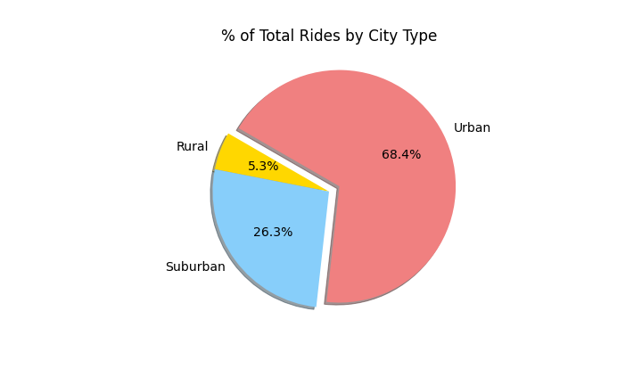

# PyBer_Analysis  

## Overview of the analysis 

Today is the day, we just received the work assignment of a lifetime by being assigned a compelling project from V. Isualize and we are excited and ready for the challenge.  We have been asked to create a summary of the ride-sharing data by city type as well as create a multiple-line graph that shows the total weekly fares for each city type.  To accomplish this task, we will need to analyze two datasets containing four months of rideshare data ranging from January to early May of 2019.  Creating data analysis and visualizations of rideshare data for PyBer will help to improve access to ride-sharing services and affordability for underserved neighborhoods.  As you can see below, we have a great dataset to review but we need to sharpen our focus and outputs in order to offer three business recommendations to the CEO for addressing any disparities among the city types. Let’s get ready to drive results and solutions to V. Isualize and the PyBer decision-makers.  

  

## Results  

**Organize the Data**  
One of the most critical steps of our process was to organize of the ride-sharing data by total rides, total drivers, and total fares.  From there, we calculated the average fare per ride and average fare per driver for each city type.  Please see chart below to see how the data mapped out under each column heading.  

  

**Total Rides, Total Drivers, and Total Fares - Oh My**  

When we look at the data - it tells a telling story for the Urban City Type.  They hold the largest totals and percentages for Total Rides, Total Drivers, and Total Fares.  That falls inline with economic expectations - where there is a large demand, there will be a large supply of service as well.  Sububran is steady producer for totals and I think that is expected.  We need to remember the Rural City Type - this will be an area of recommendation.   
  

  

  

  

## Summary  
